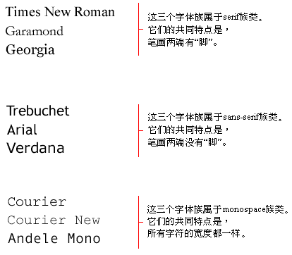
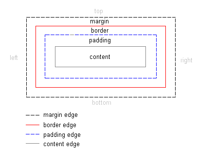

### Base Css knowledge

> 以下内容来源于 [css tutorial](http://zh.html.net/tutorials/css/)


1. background

```css
{background: #FFCC66 url("img") no-repeat fixed right bottom;}

/* 顺序 background-color | background-image | background-repeat 
| background-attachment | background-position */
```


2. font

```css
p {	font: italic bold 30px arial, sans-serif;}
/* 顺序 font-style | font-variant | font-weight | font-size | font-family */ 
```

- font-family

字体族名称（family-name 就是我们通常所说的“字体”）: 例子包括“Arial”、“Times New Roman”、“宋体”、“黑体”等等。
族类（generic family）:一个族类是一组具有统一外观的字体族。sans-serif就是一例，它代表一组没有“脚”的字体。

```html
 body{font-family: arial, verdana, sans-serif;}
 arial, verdana 候选字体，都没有用同一族类的字体
```

- font-style

定义所选字体的显示样式: normal（正常）、italic（斜体）或oblique（倾斜）

- font-variant

可以为normal（正常）或small-caps（小体大写字母）。small-caps字体是一种以小尺寸显示的大写字母来代替小写字母的字体。

- font-weight

normal（正常）或bold（加粗

- font-size

字体大小可通过多种不同单位（比如像素或百分比等）来设置.

px / pt / % / em

px和pt 将问题设置成固定大小
%和em 允许浏览器自行调整大小


3. text(文本)

- text-indent

为段落设置首行缩进。
```css
p {text-indent: 30px;}
```

- text-align

left（左对齐）、right（右对齐）或者center（居中）,justify(两端对齐)

-- text-decoration

为文本增添下划线 (underline)、删除线 (line-through)、上划线(overline) 等等

-- letter-spacing

用于设置文本的水平字间距. (px)

-- text-transform

通过该属性令文本首字母大写（capitalize）、全部大写（uppercase）或者全部小写（lowercase）,none


4. link(链接)

伪类
link用于浏览者从未访问过的链接
visited用于浏览者已访问过的链接
active用于活动的链接（即获得当前焦点的
hover用于有鼠标悬停的链接。链接）。
```css
a:link {color: blue;}
a:visited {color: red;}
a:a:active {color: red;}
a:hover {color: red;}
```


5. 盒状模型



- border-width

可以是“thin”（薄）、“medium”（普通）或“thick”（厚）等

- border-style

dotted/dashed/solid/double/groove/ridge/inset/outset


7. 元素的定位

绝对定位: 一个采用绝对定位的元素不获得任何空间。这意味着：该元素在被定位后不会留下空位
```css
h1 {
    position:absolute;
    top: 100px;
    left: 200px;
}
```

相对定位： 要对元素进行相对定位，应将position属性的值设为relative。绝对定位与相对定位的区别在于计算位置的方式。


**采用相对定位的元素，其位置是相对于它在文档中的原始位置计算而来的。这意味着，相对定位是通过将元素从原来的位置向右、向左、向上或向下移动来定位的。采用相对定位的元素会获得相应的空间。**


